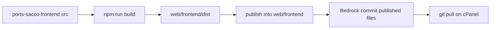

# Ports SACCO site

Headless WordPress (Roots Bedrock) + React (Vite) SPA. WordPress powers content and `/wp-json`; the React app is the public site.

| Path / repo | Role |
|-------------|------|
| **This Bedrock repo** | WordPress, plugins, Apache entry points; **published** SPA under `web/frontend/` |
| **[ports-sacco-frontend](https://github.com/jkkenzie/ports-sacco-frontend)** | React/Vite **source** (`src/`, `package.json`, …), nested under `web/frontend/` for local builds |

On the server, `git pull` of Bedrock updates `public_html/frontend/` (`index.html`, `assets/`, …). **No npm on the server.** Build locally, then commit only the published files into Bedrock.



---

## Prerequisites

- PHP 8.1+, Composer
- Node.js 18+ and npm (**build machines only**)
- Git
- Apache (WAMP/cPanel) with `mod_rewrite`

---

## First-time setup

```bash
git clone <bedrock-remote-url> site
cd site

# WordPress / PHP
composer install
cp .env.example .env
# Edit .env: DB_*, WP_HOME, salts, Twilio, etc.
# Production / cPanel: also set WEBROOT_DIR and PHP_ERROR_LOG (see .env.example)

# Apache rules (web/.htaccess is gitignored)
cp web/.htaccess.example web/.htaccess
```

### Frontend source (local / build machine)

`web/frontend/src` is **not** in Bedrock. Use the nested repo:

```bash
cd web/frontend
# If this folder has no .git yet (fresh Bedrock clone with published files only):
git init
git remote add origin https://github.com/jkkenzie/ports-sacco-frontend.git
git fetch origin
git checkout -B main origin/main
# Keep existing published index.html / assets/ if checkout would overwrite — stash or rebuild after.

cp .env.example .env
npm install
```

Point your vhost document root at `web/` (Bedrock web root). On cPanel, document root is usually `public_html` with `WEBROOT_DIR` set in `.env`.

---

## Local development

### WordPress

Use WAMP (or similar) so `WP_HOME` in the root `.env` resolves (e.g. `http://ports-sacco`).

### React (Vite) — inside ports-sacco-frontend

```bash
cd web/frontend
npm run dev
```

- App: `http://localhost:3000`
- `/wp-json` is proxied to `WP_HOME` from the Bedrock root `.env`

### Production-like preview

```bash
cd web/frontend
npm run build
npm run preview
```

`npm run build` = `vite build` + publish `dist/` → `index.html` / `assets/` in **this same folder** (one level up from `dist/`). Fonts/images under `assets/` are preserved.

---

## Building and shipping the SPA

### 1. Configure build env

In `web/frontend/.env` (ports-sacco-frontend):

| Variable | Purpose |
|----------|---------|
| `VITE_BASE_PATH` | `/` when the SPA is at the site root; `/frontend/` when served under `/frontend/` |
| `VITE_WP_HOME` | Optional override; otherwise Vite reads `WP_HOME` from the Bedrock root `.env` |
| `VITE_WP_API_BASE` | Leave empty for same-origin `/wp-json`; set only if the API is on another host |
| `VITE_PUBLIC_URL` | Public site URL (canonicals / shares); defaults from `WP_HOME` + base |
| `VITE_WP_FRESH_API` | `true` for local cache-busting; omit on production |

### 2. Build (local)

```bash
cd web/frontend
npm install
npm run build
```

### 3. Commit published files in **Bedrock** (what the server pulls)

```bash
cd ../..   # Bedrock root
git add web/frontend/index.html web/frontend/favicon.svg web/frontend/team-bg.png web/frontend/team-bg.svg web/frontend/assets
git commit -m "Update published SPA build"
git push origin main
```

Do **not** add `web/frontend/src` (gitignored). Commit source changes only in the ports-sacco-frontend repo.

### Base-path modes

| Mode | `VITE_BASE_PATH` | Typical URL |
|------|------------------|-------------|
| Site root (`.htaccess.example` + `app.php`) | `/` | `https://example.com/membership` |
| Subfolder | `/frontend/` | `https://example.com/frontend/membership` |

---

## Git workflow (two remotes)

### A. Source (ports-sacco-frontend)

```bash
cd web/frontend
git status
git add src ...
git commit -m "Describe the frontend source change"
git push origin main
```

### B. Published SPA + PHP (Bedrock)

```bash
# after npm run build in web/frontend
cd /path/to/bedrock
git add web/frontend/index.html web/frontend/assets web/frontend/favicon.svg web/frontend/team-bg.png web/frontend/team-bg.svg
git add web/app/plugins/headless-core   # etc. for PHP
git commit -m "Describe the change"
git push origin main
```

---

## Deploying `main` on the server

Published SPA files are in Bedrock. The server does **not** need Node.

```bash
cd /path/to/bedrock   # parent of public_html / web
git checkout main
git pull origin main
composer install --no-dev --optimize-autoloader
```

Ensure production `.env` includes `WEBROOT_DIR` / `PHP_ERROR_LOG` on cPanel. Refresh `web/.htaccess` from `web/.htaccess.example` when rewrite rules change.

### Smoke-check

- Homepage loads (SEO shell via `app.php`)
- A content page (e.g. `/membership`) renders blocks from the API
- `/wp-json/portsacco/v1/...` responds (`/custom/v1` still aliased temporarily)
- `/sitemap.xml` and `/robots.txt` hit the PHP entry points, not the SPA
- `public_html/frontend/` has `index.html` + `assets/` from the pull (no `src/`, no `node_modules/`)

---

## Apache / routing notes

`web/.htaccess` (from `.htaccess.example`) must keep this order:

1. `/assets/*` → `/frontend/assets/*`
2. SEO `/sitemap.xml`, `/robots.txt` → PHP scripts
3. WordPress admin / `wp/` / `wp-json` paths pass through
4. Everything else → `app.php` (SPA shell + SEO `<head>`)

If the SPA catch-all runs first, sitemaps and the REST API will break.

---

## Cloudflare + security controls

Public forms and the WP REST API must keep working behind Cloudflare. Prefer **narrow exception rules** for the specific managed rulesets blocking editor saves / form POSTs (provider option 3), after compensating controls are in place:

### Already in application code
- Form POSTs: WordPress REST nonce + honeypot; optional Cloudflare Turnstile
- Nonce / form routes: `Cache-Control` / `CDN-Cache-Control: no-store` (never edge-cache auth tokens)
- Security HTTP headers via Headless Core (`inc/security-headers.php`), SPA `app.php`, and `web/.htaccess.example`
- Bedrock: `DISALLOW_FILE_EDIT`, `DISALLOW_FILE_MODS`, `FORCE_SSL_ADMIN` when `WP_HOME` is HTTPS

### Cloudflare dashboard (ops)
1. **Rocket Loader → Off**
2. **Cache Rule**: Bypass `/wp-json/*` (especially `/wp-json/portsacco/v1/nonce*` and legacy `/wp-json/custom/v1/nonce*`)
3. **Cloudflare Access** for `/wp-admin` and `/wp-login.php` only (not public forms)
4. Exception / skip **only** the managed rulesets blocking legitimate editor/form POSTs — not a blanket WAF bypass

---

## Useful paths

| Path | Purpose |
|------|---------|
| `.env` | Bedrock / WordPress env |
| `web/.htaccess.example` | Canonical Apache rules |
| `web/app.php` | SPA HTML + SEO injection |
| `web/frontend/` | Published SPA (Bedrock) + nested ports-sacco-frontend source (local) |
| `web/app/plugins/headless-core/` | Headless CMS, blocks, REST, SEO |
| `web/app/plugins/chat-engine/` | Chat / WhatsApp (see its `DOCS.md`) |

---

## Based on Bedrock

WordPress layout and Composer setup follow [Roots Bedrock](https://roots.io/bedrock/). Project-specific behaviour (headless frontend, SEO shell, plugins) is documented above.
