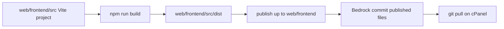

# Ports SACCO site

Headless WordPress (Roots Bedrock) + React (Vite) SPA. WordPress powers content and `/wp-json`; the React app is the public site.

| Path / repo | Role |
|-------------|------|
| **This Bedrock repo** | WordPress, plugins, Apache entry points; **published** SPA under `web/frontend/` |
| **[ports-sacco-frontend](https://github.com/jkkenzie/ports-sacco-frontend)** | React/Vite project at `web/frontend/src/` for local builds |

On the server, `git pull` of Bedrock updates `public_html/frontend/` (`index.html`, `assets/`, …). **No npm on the server.** Build locally, then commit only the published files into Bedrock.



---

## Headless REST namespace (`portsacco/v1`)

Custom Headless Core routes no longer use the generic `/wp-json/custom/v1/` prefix. The project namespace is:

| | Namespace | Example |
|---|-----------|---------|
| **Primary** | `portsacco/v1` | `/wp-json/portsacco/v1/nonce` |
| **Legacy alias** (temporary) | `custom/v1` | `/wp-json/custom/v1/nonce` |

Same callbacks are registered on both namespaces during cutover so cached old SPA builds keep working.

**PHP (Headless Core):** `HEADLESS_CORE_REST_NAMESPACE` / `HEADLESS_CORE_REST_NAMESPACE_LEGACY` in `web/app/plugins/headless-core/headless-core.php`, with dual registration via `inc/rest-namespace.php`.

Common routes under the primary namespace include `/nonce`, `/contact`, `/submit-form`, `/page/{slug}`, CPT lists, `/header`, `/footer`, and `/seo/sitemap`.

For how the SPA talks to these routes **behind Cloudflare**, see [Forms + Cloudflare workarounds](#forms--cloudflare-workarounds) below.

---

## Forms + Cloudflare workarounds

Cloudflare can return an HTML **403** for `/wp-json/...` even when the origin is healthy (`curl --resolve` → JSON 200). Public forms (contact, membership / onboarding, newsletter, news comments) must keep working **without** requiring a WAF change. The durable fix is still a narrow CF skip for `/wp-json/portsacco/v1/*` (and chat); until then, keep the pieces below.

### How forms get a nonce

```text
1. app.php injects window.__HC_FORM_BOOTSTRAP__ into the SPA shell (preferred)
2. On force-refresh (every submit): GET /hc-bootstrap.php
3. Fallback: GET /wp-json/custom/v1/nonce
4. Last resort: reuse the inline __HC_FORM_BOOTSTRAP__ nonce
```

SPA logic: `web/frontend/src/src/api/formBootstrap.js` → `useFormNonce`.  
PHP inject: `headless_core_inject_form_bootstrap_script()` in `web/app/plugins/headless-core/inc/rest-nonce.php`, called from `web/app.php` with `Cache-Control: no-store` on the shell.

### How form POSTs avoid `/wp-json`

| Form | REST route | Browser calls |
|------|------------|---------------|
| Contact / Asset Finance apply | `/contact` | `/hc-api.php?rest_route=/custom/v1/contact` |
| Membership / onboarding | `/submit-form` | `/hc-api.php?rest_route=/custom/v1/submit-form` |
| Newsletter | `/newsletter-subscribe` | `/hc-api.php?rest_route=/custom/v1/newsletter-subscribe` |
| News comments | `/news/{slug}/comments` | `/hc-api.php?rest_route=/custom/v1/news/.../comments` |

`formApiUrl()` in `web/frontend/src/src/api/wp.js` builds those URLs. `web/hc-api.php` allowlists only those routes (plus `/nonce`) under `custom/v1` or `portsacco/v1` and runs them via `rest_do_request`.

### Gutenberg saves (Cloudflare WAF)

WordPress admin saves pages through `PUT/POST /wp-json/wp/v2/pages/{id}` with a JSON body whose `content` field is Gutenberg HTML. Cloudflare’s WAF often blocks that. Public SPA reads stay on `/wp-json`; this workaround is **wp-admin only**.

#### How to recognise it

| Response in DevTools | What it actually is |
|----------------------|---------------------|
| HTML titled **Sorry, you have been blocked** / `Attention Required! \| Cloudflare`, Ray ID in the footer | Cloudflare WAF (not WordPress). Origin never saw a valid REST save. |
| HTML titled **Ports Sacco - Home** with `window.__HC_FORM_BOOTSTRAP__` | The React SPA catch-all served `app.php`. The save URL was not a real PHP file (typical: `/hc-wp-api.php/wp/v2/pages/211` path-info). |
| JSON `{ "id": 211, "content": { "raw": "..." } }` | Save succeeded. |

Editor UI: Gutenberg shows a failed save; the Network tab for the page request has `Content-Type: text/html` instead of `application/json`.

#### What the WAF matches (two layers)

1. **URI** — rules that match `wp-json` in the path. Forms already avoid this via `/hc-api.php`. Gutenberg used to POST to `/wp-json/wp/v2/pages/{id}`.
2. **Body** — rules that match HTML tags (`<h2>`, `<p>`, `<!-- wp:`), SQL-like `#` hex colors (`#90D4D3`), or “malformed” nested JSON. Changing the URL is **not enough** if the raw Gutenberg `content` is still in the POST body.

That is why **Home can save while Services fails** on the same proxy: Home’s block markup does not trip the body rules; Services (Page Hero Content + core Heading/Paragraph + `#` colors + `custom/services-grid`) does.

Example payload that was blocked (page id **211**, Services):

- `custom/savings-archive-hero` with `bannerImageUrl`, `backgroundColor":"#90D4D3"`, CTA buttons to `/contact-us/`
- `core/heading` (`<h2>Our Services</h2>`)
- `core/paragraph`
- empty `custom/services-grid`

Ray IDs seen in production: `a35257210fb52610`, `a35276b8db672610`, `a3529376df58267b` (IP `149.50.217.202`). Use Cloudflare → Security → Events with the Ray ID to confirm which managed rule fired.

#### What we tried (do not repeat)

| Approach | Result |
|----------|--------|
| POST to `/wp-json/wp/v2/pages/{id}` | Cloudflare HTML block. |
| Path-style `/hc-wp-api.php/wp/v2/pages/211` | SPA catch-all: homepage HTML with `__HC_FORM_BOOTSTRAP__`. Live `web/.htaccess` is gitignored and did not get PATH_INFO rewrites. `apiFetch` also breaks on nested `?` (`rest_route=/wp/v2/...?context=edit`). |
| Query-string `/hc-wp-api.php?rest_route=/wp/v2/...` without wrapping | Avoids SPA, but Cloudflare can still block on **body**. |
| `admin-ajax.php?action=headless_core_rest_proxy` **without** wrapping | Home saved (URI under `/wp/`). Services still Cloudflare-blocked (body HTML + `#`). |
| Expanding `web/hc-api.php` to all of `/wp/v2` | Do not. That file is the public form allowlist. Mixing editor REST into it was reverted once (`38da0d3`). |

#### What works (keep this)

1. In wp-admin, rewrite Gutenberg `apiFetch` to  
   **`POST /wp/wp-admin/admin-ajax.php?action=headless_core_rest_proxy&rest_route=/wp/v2/pages/{id}`**  
   (Bedrock URL is under `/wp/`, so the SPA catch-all cannot swallow it.)
2. Convert PUT/PATCH/DELETE to POST + `X-HTTP-Method-Override` (admin-ajax is POST-oriented).
3. Wrap the JSON body as `{ "hc_wp_rest_b64": "<base64 of original JSON>" }` so the WAF never sees `<h2>`, `<!-- wp:`, or `#90D4D3`. PHP unwraps after Cloudflare, then runs `rest_do_request`.
4. Logged-in users only. Capability checks stay in WordPress REST. Media uploads (`FormData`) are not wrapped.

Disable: `HEADLESS_ADMIN_REST_PROXY=off` in `.env` (back to `/wp-json`). Optional: `HEADLESS_ADMIN_REST_PROXY=hc-wp-api` for `/hc-wp-api.php?rest_route=/` instead of admin-ajax (still wraps the body).

#### Code map

| File | Role |
|------|------|
| `web/app/plugins/headless-core/inc/rest-proxy.php` | Mode (`admin-ajax` default), `rest_url` root rewrite, enqueue script |
| `web/app/plugins/headless-core/blocks/shared/admin-rest-proxy.js` | `apiFetch` middleware: URL rewrite, method override, `hc_wp_rest_b64` wrap |
| `web/app/plugins/headless-core/inc/rest-proxy-handler.php` | Allowlist `/wp/v2` + `/batch/v1`, unwrap body, `rest_do_request` |
| `web/hc-wp-api.php` | Alternate front controller (query-string). Not the default. |
| `web/app/plugins/headless-core/blocks/savings-archive-hero/editor.js` | Page Hero Content: omit default hex colors on empty buttons (smaller JSON; not a substitute for wrapping) |

#### Verify after deploy

1. `git pull` on the server. Hard-refresh wp-admin (**Ctrl+F5**) so `admin-rest-proxy.js` is not a cached old build (`HEADLESS_CORE_VERSION` cache-busts it).
2. Network → page save:
   - URL contains `admin-ajax.php?action=headless_core_rest_proxy` (not `/wp-json`, not `/hc-wp-api.php/wp/v2/...`).
   - Request payload is `{"hc_wp_rest_b64":"..."}`, not raw `<!-- wp:heading -->`.
   - Response is JSON, not Cloudflare or the SPA shell.
3. Confirm on a **heavy** page (Services / any page with core Heading + Paragraph + hero colors), not only Home.

If wrapping is in place and Cloudflare still blocks, the rule is not matching HTML in JSON (check Events for the Ray ID). Then add a **narrow** WAF skip for `admin-ajax.php` + `action=headless_core_rest_proxy` only — not a site-wide WAF off.

### Read APIs (pages, menus, CPT lists)

Still use **`/wp-json/custom/v1/`** (`WP_CUSTOM_API`) so existing CF rules that already allow the legacy alias keep working. PHP still registers **`portsacco/v1`** as primary.

### Must keep deployed (do not delete)

| Path | Why |
|------|-----|
| `web/app.php` | SPA shell + SEO + **inline form bootstrap** + `no-store` |
| `web/hc-bootstrap.php` | Fresh nonce **outside** `/wp-json` |
| `web/hc-api.php` | Form POSTs **outside** `/wp-json` |
| `web/hc-wp-api.php` | Optional Gutenberg proxy entry (not default; see Gutenberg section) |
| `web/app/plugins/headless-core/inc/rest-proxy.php` | Gutenberg REST proxy (admin-ajax + `hc_wp_rest_b64`) |
| `web/app/plugins/headless-core/blocks/shared/admin-rest-proxy.js` | Editor `apiFetch` middleware |
| `web/app/plugins/headless-core/` (incl. `inc/rest-nonce.php`) | Bootstrap payload, dual namespaces, form REST |
| Published `web/frontend/` matching that source | SPA must call `formApiUrl` / prefer inline bootstrap |
| `web/.htaccess` from `.htaccess.example` | Physical `hc-*.php` must not be swallowed by the SPA catch-all (`!-f` + explicit exclusions) |

### Server / ops checklist

1. After `git pull`, confirm these exist under the web root (e.g. `public_html/`): `app.php`, `hc-api.php`, `hc-bootstrap.php`, `hc-wp-api.php`, `frontend/index.html`.
2. SPA pages must be served through **`app.php`** (not a static `frontend/index.html` only) so `__HC_FORM_BOOTSTRAP__` is present — View Source and search for `__HC_FORM_BOOTSTRAP__`.
3. Smoke (through Cloudflare, browser or curl to the public hostname):
   - `GET /hc-bootstrap.php` → JSON `{ "nonce": "...", "turnstileEnabled": ... }`
   - `POST /hc-api.php?rest_route=/custom/v1/contact` with a valid nonce is not an HTML CF block page
   - Contact + membership submit succeed in the UI
   - wp-admin: save **Home** and a **Services-like** page (hero + heading + paragraph). Network save URL is `admin-ajax.php?action=headless_core_rest_proxy` with body `hc_wp_rest_b64`
4. If origin works but CF still blocks `/wp-json/custom/v1/*` **reads**, content pages break too — then CF must allow at least `custom/v1` GETs, or grey-cloud is not an option; forms alone use `hc-*` but page data still needs REST.

### When Cloudflare is fixed (optional cleanup)

1. WAF skip / cache bypass for `/wp-json/portsacco/v1/*` and `/wp-json/chat/v1/*`.
2. Point SPA `WP_CUSTOM_API` back to `/wp-json/portsacco/v1` and optionally use `customApiUrl` again for form POSTs.
3. Keep `hc-api.php` / `hc-bootstrap.php` / inline inject until you verify forms under CF; then they can become optional fallbacks.
4. Gutenberg: keep the admin-ajax + `hc_wp_rest_b64` proxy until a **Services-like** page (heading + paragraph + hero colors) saves via `/wp-json` without a CF block page. Then you may set `HEADLESS_ADMIN_REST_PROXY=off`. Do not remove the proxy code until that is verified — URI skips alone do not stop body WAF rules.

---

## Prerequisites

- PHP 8.1+, Composer
- Node.js 18+ and npm (**build machines only**)
- Git
- Apache (WAMP/cPanel) with `mod_rewrite`

---

## First-time setup

```bash
git clone <bedrock-remote-url> site
cd site

# WordPress / PHP
composer install
cp .env.example .env
# Edit .env: DB_*, WP_HOME, salts, Twilio, etc.
# Production / cPanel: also set WEBROOT_DIR and PHP_ERROR_LOG (see .env.example)

# Apache rules (web/.htaccess is gitignored)
cp web/.htaccess.example web/.htaccess
```

### Frontend source (local / build machine)

`web/frontend/src` is **not** in Bedrock. Use the nested repo there:

```bash
cd web/frontend/src
# If this folder has no .git yet:
git init
git remote add origin https://github.com/jkkenzie/ports-sacco-frontend.git
git fetch origin
git checkout -B main origin/main

cp .env.example .env
npm install
```

Point your vhost document root at `web/` (Bedrock web root). On cPanel, document root is usually `public_html` with `WEBROOT_DIR` set in `.env`.

---

## Local development

### WordPress

Use WAMP (or similar) so `WP_HOME` in the root `.env` resolves (e.g. `http://ports-sacco`).

### React (Vite) — inside ports-sacco-frontend

```bash
cd web/frontend/src
npm run dev
```

- App: `http://localhost:3000`
- `/wp-json` is proxied to `WP_HOME` from the Bedrock root `.env`

### Production-like preview

```bash
cd web/frontend/src
npm run build
npm run preview
```

`npm run build` = `vite build` + publish `dist/` **one level up** into `web/frontend/` (`index.html`, `assets/`, fonts/images synced).

---

## Building and shipping the SPA

### 1. Configure build env

In `web/frontend/src/.env` (ports-sacco-frontend):

| Variable | Purpose |
|----------|---------|
| `VITE_BASE_PATH` | `/` when the SPA is at the site root; `/frontend/` when served under `/frontend/` |
| `VITE_WP_HOME` | Optional override; otherwise Vite reads `WP_HOME` from the Bedrock root `.env` |
| `VITE_WP_API_BASE` | Leave empty for same-origin `/wp-json`; set only if the API is on another host |
| `VITE_PUBLIC_URL` | Public site URL (canonicals / shares); defaults from `WP_HOME` + base |
| `VITE_WP_FRESH_API` | `true` for local cache-busting; omit on production |

### 2. Build (local)

```bash
cd web/frontend/src
npm install
npm run build
```

### 3. Commit published files in **Bedrock** (what the server pulls)

```bash
cd ../../..   # Bedrock root
git add web/frontend/index.html web/frontend/favicon.svg web/frontend/team-bg.png web/frontend/team-bg.svg web/frontend/assets
git commit -m "Update published SPA build"
git push origin main
```

Do **not** add `web/frontend/src` (gitignored). Commit source changes only in the ports-sacco-frontend repo.

### Base-path modes

| Mode | `VITE_BASE_PATH` | Typical URL |
|------|------------------|-------------|
| Site root (`.htaccess.example` + `app.php`) | `/` | `https://example.com/membership` |
| Subfolder | `/frontend/` | `https://example.com/frontend/membership` |

---

## Git workflow (two remotes)

### A. Source (ports-sacco-frontend)

```bash
cd web/frontend/src
git status
git add .
git commit -m "Describe the frontend source change"
git push origin main
```

### B. Published SPA + PHP (Bedrock)

```bash
# after npm run build in web/frontend/src
cd /path/to/bedrock
git add web/frontend/index.html web/frontend/assets web/frontend/favicon.svg web/frontend/team-bg.png web/frontend/team-bg.svg
git add web/app/plugins/headless-core   # etc. for PHP
git commit -m "Describe the change"
git push origin main
```

---

## Server Deployment (cPanel / CloudLinux)

### Architecture

This Bedrock repo is the project root and lives **outside** the web-exposed directory. On production it is typically `~/portsacco_core/`. The cPanel document root, `public_html/`, contains **symlinks** into `portsacco_core/web/` (plus a real `.htaccess`):

```text
~/portsacco_core/                 ← git repo root (NOT web-accessible)
├── .env                          ← real DB creds, salts, secrets (gitignored, chmod 600)
├── config/
├── vendor/                       ← composer dependencies
├── web/                          ← Bedrock public webroot content
│   ├── app/                      (uploads, plugins, mu-plugins, themes)
│   ├── wp/                       (WordPress core, composer-managed)
│   ├── frontend/                 (published React SPA — index.html, assets/)
│   ├── app.php, index.php, wp-config.php, wp-api.php, …
└── deploy.sh                     ← optional server helper (git pull + composer)

~/public_html/                    ← actual document root (symlinks only, except .htaccess)
├── app            → ~/portsacco_core/web/app
├── app.php        → ~/portsacco_core/web/app.php
├── wp             → ~/portsacco_core/web/wp
├── wp-config.php  → ~/portsacco_core/web/wp-config.php
├── index.php      → ~/portsacco_core/web/index.php
├── frontend       → ~/portsacco_core/web/frontend
├── favicon.svg, robots.php, sitemap.php, wp-api.php, wp-index.php  (symlinked as needed)
└── .htaccess                     ← REAL FILE, not symlinked, not tracked by git
```

`WEBROOT_DIR` in `.env` must be the cPanel document root (`/home/USER/public_html`), **not** `~/portsacco_core/web`.

### What is and isn't tracked by git

**Tracked (deployed via `git pull`):**

- PHP entry points (`app.php`, `index.php`, `wp-api.php`, `sitemap.php`, `robots.php`, …)
- `composer.json` / `composer.lock`
- `config/application.php` + environment overrides
- Whitelisted plugins: `chat-engine`, `services-page-editor`, `headless-core`
- Custom mu-plugins that are committed (e.g. `web/app/mu-plugins/cors-header.php` when present)
- **Published SPA** under `web/frontend/` (`index.html`, hashed `assets/`, `favicon.svg`, `team-bg.*`) — built locally from [ports-sacco-frontend](https://github.com/jkkenzie/ports-sacco-frontend) (`web/frontend/src/`), then committed here. No npm on the server.

**Not tracked — installed by Composer on deploy:**

- `web/wp/` (WordPress core — `roots/wordpress`)
- Bedrock Composer mu-plugins (e.g. `bedrock-autoloader.php`, `bedrock-disallow-indexing/`)
- WPackagist plugins/themes such as `newsletter/`, `twentytwentyfive/`

**Not tracked — server-only; must persist across deploys (never delete):**

- `.env` — DB credentials, WP salts, Twilio / Turnstile secrets. **The site will not boot without this.**
- `web/app/uploads/` — media library
- Unmanaged plugins installed only on the server, e.g.:
  - `web/app/plugins/insert-headers-and-footers/`
  - `web/app/plugins/iyi-smtp-mail/`
  - `web/app/plugins/wordpress-importer/`
- `web/favicon.svg`, `web/wp-index.php` — legacy files outside the published SPA path when present
- `public_html/.htaccess` — server-specific rewrite rules; template is `web/.htaccess.example` (copy manually per server; never symlink)

`web/frontend/src/` (Vite source / nested frontend git) is gitignored in this repo and should not exist on production.

### Deploying updates

```bash
~/portsacco_core/deploy.sh
```

Typical `deploy.sh` behaviour: `git pull origin main` + `composer install --no-dev --optimize-autoloader`. It must **never** overwrite `.env`, wipe `uploads/`, or remove the unmanaged plugins listed above.

Equivalent manual steps:

```bash
cd ~/portsacco_core
git checkout main
git pull origin main
composer install --no-dev --optimize-autoloader
```

After pull, `public_html/frontend/` (symlink) already shows the new published SPA. Refresh `public_html/.htaccess` from `web/.htaccess.example` only when rewrite rules change.

**If `composer install` fails with a "package not present in lock file" error:**  
someone edited `composer.json` without updating the lock. Fix:

```bash
cd ~/portsacco_core
composer update <package-name> --no-dev
# Prefer fixing on a local/dev machine, then:
git add composer.lock
git commit -m "Fix composer.lock"
git push origin main
```

Then re-run `deploy.sh`. Going forward, always use `composer require` / `composer update` and commit `composer.lock` — never hand-edit `composer.json` alone.

### First-time server setup (new environment)

1. Generate an SSH deploy key on the server, add the public key to the GitHub repo’s Deploy Keys, and configure `~/.ssh/config` to use it for `github.com`.
2. `git clone git@github.com:jkkenzie/ports-sacco-backend.git ~/portsacco_core` (or this repo’s SSH URL).
3. `cd ~/portsacco_core && composer install --no-dev --optimize-autoloader`
4. Copy the real `.env` from the previous server or a password manager into `~/portsacco_core/.env`, then `chmod 600 ~/portsacco_core/.env`.  
   Set `WEBROOT_DIR` to the cPanel document root (`…/public_html`) and `PHP_ERROR_LOG` if desired (see `.env.example`).
5. Restore server-only data: `uploads/`, unmanaged plugins (list above). Published `web/frontend/` comes from git once it is committed on `main`.
6. In `public_html/`, symlink the web paths into `~/portsacco_core/web/<item>`. Copy `.htaccess` as a **real file** from `web/.htaccess.example`, then adjust per-server — never symlink `.htaccess`.
7. Verify: `curl -I --resolve <domain>:443:<server-ip> https://<domain>/` and check `~/public_html/error_log` (or `PHP_ERROR_LOG`).

### Smoke-check

- Homepage loads (SEO shell via `app.php`)
- A content page (e.g. `/membership`) renders blocks from the API
- View Source on a form page includes `window.__HC_FORM_BOOTSTRAP__`
- `GET /hc-bootstrap.php` returns JSON nonce (through CF)
- `/wp-json/portsacco/v1/nonce` and `/wp-json/custom/v1/nonce` respond on **origin**; through CF, prefer `/hc-bootstrap.php` if `/wp-json` is blocked
- Contact + membership form submit succeed (POSTs go to `/hc-api.php`)
- `/sitemap.xml` and `/robots.txt` hit the PHP entry points, not the SPA
- `public_html/frontend/` has `index.html` + `assets/` from the pull (no `src/`, no `node_modules/`)

### Known gotchas

- **No `rsync`** on this CloudLinux jailed shell — use `cp -a` instead.
- **CloudLinux / `open_basedir`**: if PHP cannot read across the symlink boundary between `public_html` and `portsacco_core`, check `php -i | grep open_basedir`. It should be empty/unrestricted for this layout.
- **Cloudflare**: if the origin is healthy on direct-IP testing but the public domain 403s, the block is often at Cloudflare’s edge (Security → Events), not Apache. Forms use `hc-api.php` / `hc-bootstrap.php` / inline bootstrap — see [Forms + Cloudflare workarounds](#forms--cloudflare-workarounds). A burst of origin 5xx during a bad deploy can also trigger WAF heuristics.
- **`.htaccess` is never git-tracked** — `web/.htaccess.example` is the template; live rules stay in `public_html/.htaccess`.

---

## Apache / routing notes

`web/.htaccess` (from `.htaccess.example`) must keep this order:

1. `/assets/*` → `/frontend/assets/*`
2. SEO `/sitemap.xml`, `/robots.txt` → PHP scripts
3. WordPress admin / `wp/` / `wp-json` paths pass through
4. Physical files such as `app.php`, `hc-api.php`, `hc-bootstrap.php`, `hc-wp-api.php` are served as files (`!-f`; example also excludes them explicitly)
5. Everything else → `app.php` (SPA shell + SEO `<head>` + form bootstrap)

If the SPA catch-all runs first, sitemaps, the REST API, and `hc-*.php` form endpoints will break.

---

## Cloudflare + security controls

Public forms and the WP REST API must keep working behind Cloudflare. Prefer **narrow exception rules** for the specific managed rulesets blocking editor saves / form POSTs (provider option 3), after compensating controls are in place.

**App-level workarounds (already shipped):** see [Forms + Cloudflare workarounds](#forms--cloudflare-workarounds) — keep `app.php` inject, `hc-bootstrap.php`, `hc-api.php`, Gutenberg admin-ajax + `hc_wp_rest_b64` (see [Gutenberg saves](#gutenberg-saves-cloudflare-waf)), SPA `formApiUrl` / `custom/v1` reads, and dual REST namespaces until CF allows `portsacco/v1`.

### Already in application code
- Form POSTs: WordPress REST nonce + honeypot; optional Cloudflare Turnstile
- Form traffic prefers `/hc-api.php` and `/hc-bootstrap.php` so WAF rules matching `wp-json` do not block submits
- Gutenberg in wp-admin: `admin-ajax.php?action=headless_core_rest_proxy` + base64-wrapped JSON body (`hc_wp_rest_b64`). URI bypass is not enough; WAF also inspects Gutenberg HTML. Details: [Gutenberg saves (Cloudflare WAF)](#gutenberg-saves-cloudflare-waf). Disable with `HEADLESS_ADMIN_REST_PROXY=off`.
- Nonce / form routes: `Cache-Control` / `CDN-Cache-Control: no-store` (never edge-cache auth tokens); SPA shell from `app.php` is also `no-store`
- Security HTTP headers via Headless Core (`inc/security-headers.php`), SPA `app.php`, and `web/.htaccess.example`
- Bedrock: `DISALLOW_FILE_EDIT`, `DISALLOW_FILE_MODS`, `FORCE_SSL_ADMIN` when `WP_HOME` is HTTPS

### Cloudflare dashboard (ops)
1. **Rocket Loader → Off**
2. **Cache Rule**: Bypass `/wp-json/*`, `/hc-api.php*`, `/hc-bootstrap.php*`, `/hc-wp-api.php*` (and especially nonce / chat paths)
3. **Cloudflare Access** for `/wp-admin` and `/wp-login.php` only (not public forms, not `hc-*.php`)
4. Exception / skip **only** the managed rulesets blocking legitimate editor/form POSTs and REST GETs — not a blanket WAF bypass
5. Ideal end state: allow `/wp-json/portsacco/v1/*` and `/wp-json/chat/v1/*`, then optionally retire the SPA workarounds (see cleanup notes in the forms section)

---

## Useful paths

| Path | Purpose |
|------|---------|
| `.env` | Bedrock / WordPress env |
| `web/.htaccess.example` | Canonical Apache rules |
| `web/app.php` | SPA HTML + SEO + form bootstrap inject |
| `web/hc-bootstrap.php` | Form nonce JSON outside `/wp-json` (CF workaround) |
| `web/hc-api.php` | Allowlisted form REST proxy outside `/wp-json` (CF workaround) |
| `web/hc-wp-api.php` | Optional Gutenberg REST front controller (default is admin-ajax; see README Gutenberg section) |
| `web/app/plugins/headless-core/inc/rest-proxy.php` | Gutenberg proxy settings + script enqueue |
| `web/app/plugins/headless-core/blocks/shared/admin-rest-proxy.js` | Gutenberg `apiFetch` URL + `hc_wp_rest_b64` wrap |
| `web/frontend/` | Published SPA (Bedrock tracks) |
| `web/frontend/src/` | Vite project / ports-sacco-frontend (local nested git) |
| `web/app/plugins/headless-core/` | Headless CMS, blocks, REST (`portsacco/v1`), SEO |
| `/wp-json/portsacco/v1/` | Primary headless REST API (legacy: `/wp-json/custom/v1/`) |
| `web/app/plugins/chat-engine/` | Chat / WhatsApp (see its `DOCS.md`) |

---

## Based on Bedrock

WordPress layout and Composer setup follow [Roots Bedrock](https://roots.io/bedrock/). Project-specific behaviour (headless frontend, SEO shell, plugins) is documented above.
